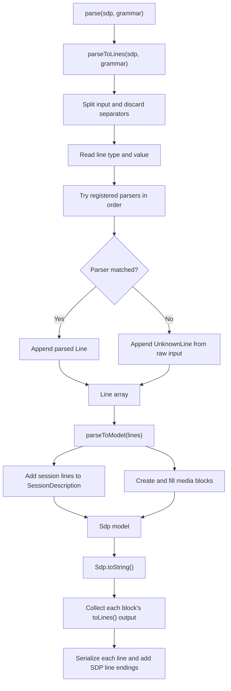
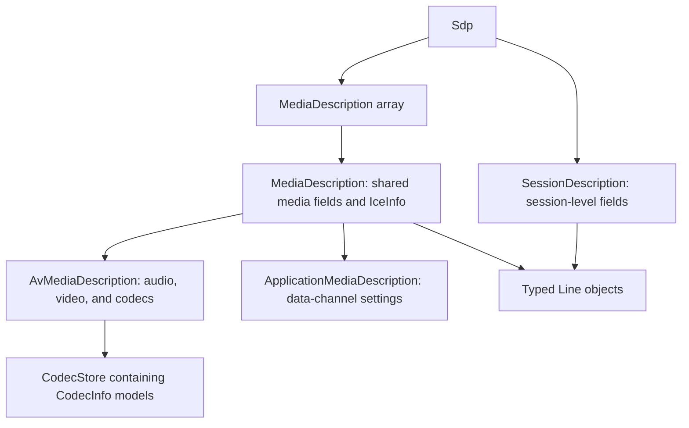

# ts-sdp Architecture

## Scope

`@webex/ts-sdp` provides typed parsing, manipulation, and serialization for Session Description Protocol (SDP). It models session-level data and supported audio, video, and application media sections. The implementation covers a useful subset of [RFC 4566](https://datatracker.ietf.org/doc/html/rfc4566) plus additional attributes used during WebRTC media negotiation.

This page describes only boundaries visible in the public repository.

## Parse and serialization flow

`parse()` in `src/parser.ts` composes two public stages:

1. `parseToLines()` splits text, derives the one-character line type, and passes the value after `x=` to parsers registered for that type.
2. `parseToModel()` starts with the session block, creates a media block at each `MediaLine`, and routes later lines into that block.

`Sdp.toString()` asks the session and media blocks for ordered lines and calls each line's `toSdpLine()`. It joins the serialized lines with CRLF and adds CRLF after the final line. CRLF means carriage return plus line feed (`\r\n`), the standard two-character line ending used by the serializer.

The serializer produces the model's canonical ordering. Tests that need semantic round trips compare line membership rather than requiring input order to remain unchanged.

## Grammar and custom parsers

`Grammar` owns a `Map` from SDP line type to an ordered list of parser functions. `addParser()` appends, so registration order is significant when more than one parser could recognize the same value.

The default grammar registers session fields, media lines, and supported attributes such as codec maps, RTCP feedback, ICE data, bundle groups, simulcast, and SSRC information. `DefaultSdpGrammar` is a shared instance.

Consumers can extend parsing in either of two ways:

- Add a parser to `DefaultSdpGrammar` when the extension should affect subsequent default parsing in that runtime.
- Create a `Grammar`, register the desired parsers, and pass it to `parse()` when isolation is required.

A custom parser receives the line value without the `x=` prefix and returns a `Line` subclass or `undefined`. The subclass must return a complete SDP line from `toSdpLine()`.

When every registered parser returns `undefined`, `parseToLines()` creates an internal `UnknownLine` from the complete raw line. `UnknownLine` is intentionally absent from `src/lines/index.ts`, but the resulting line remains in a block's `otherLines` collection and serializes unchanged.

## Line and block models

`Sdp` contains one session description and an array of media descriptions. The shared `MediaDescription` model provides common media and ICE fields, while its two concrete models add audio/video codec data or application data-channel settings. Session and media blocks both collect typed `Line` objects and expose `addLine()` and `toLines()` through the `SdpBlock` interface.

### Lines

Concrete classes under `src/lines/` pair a static `fromSdpLine()` parser with `toSdpLine()` serialization. `src/lines/index.ts` is the public export entry point for supported line classes and related types.

`PayloadTypeRef` represents numeric codec payload types and the wildcard used by RTCP feedback. `CodecStore` keeps wildcard feedback separate from per-codec feedback so wildcard semantics survive serialization.

### Session block

`SessionDescription` stores modeled session fields such as version, origin, name, connection, timing, bandwidth, and bundle groups. Unhandled or custom lines go to `otherLines`.

### Media blocks

`MediaDescription` owns fields shared by all supported media types, including media type, port, protocol, MID, ICE information, fingerprint, setup, bandwidth, connection, content, and fallback lines.

`parseToModel()` creates:

- `AvMediaDescription` for `audio` and `video`, with payload types, codecs, RTP header extensions, RID, simulcast, direction, RTCP mux, SSRC, and SSRC groups.
- `ApplicationMediaDescription` for `application`, with string formats, SCTP port, and maximum message size.

Other media types currently throw an `Unhandled media type` error. Expanding that set changes accepted input behavior and requires compatibility analysis.

### Codec and ICE composition

`AvMediaDescription` initializes one `CodecInfo` for every payload type on its media line. `CodecStore` routes RTP map, format parameters, and RTCP feedback to the matching codec and rejects unknown numeric payload references. Wildcard RTCP feedback is valid without a numeric codec.

`CodecInfo` combines the codec name, clock rate, encoding parameters, format parameters, feedback, and an optional `apt` relationship to a primary payload type.

`IceInfo` groups username fragments, passwords, options, and candidates. It participates in the same `SdpBlock` protocol as session and media models.

## Munging helpers

`src/munge.ts` provides operations over parsed models:

- `disableRtcpFbValue()`, `disableRemb()`, and `disableTwcc()` remove feedback across audio/video media or one `AvMediaDescription`.
- `removeCodec()` removes matching codecs case-insensitively and delegates to `removePt()`, which also removes secondary codecs linked through `apt`.
- `retainCodecs()` and `retainCodecsByCodecName()` filter codecs on one audio/video block and report whether anything changed.
- `retainCandidates()` and `retainCandidatesByTransportType()` filter ICE candidates across all media in an `Sdp` or one media block and report whether anything changed.

The media scopes differ intentionally: codec and RTCP helpers operate on `avMedia`, while candidate helpers operate on every media block. Preserve that distinction unless an API change is explicit.

## Public exports and compatibility boundaries

`src/index.ts` re-exports:

- parser functions, `Grammar`, and `DefaultSdpGrammar`
- supported line classes and related types
- session, media, codec, ICE, and block models
- munging helpers
- regex helpers and utilities

The package exposes one root entry point and no subpath exports. Compatibility-sensitive changes include:

- adding, removing, renaming, or changing exported symbols
- changing accepted line syntax or parser precedence
- changing fallback preservation or model routing
- changing serialization order or line formatting
- changing thrown errors for unsupported media or invalid payload references
- changing ESM, CommonJS, declaration paths, or runtime dependencies

## Build formats and runtime dependencies

`rollup.config.js` builds from `src/index.ts`:

- ESM JavaScript under `dist/esm/`
- CommonJS JavaScript under `dist/cjs/`
- bundled declarations under `dist/types/`

`package.json` maps `import`, `require`, and top-level type resolution to those outputs and publishes only `dist/**/*`.

There are no runtime `dependencies` in `package.json`. Rollup, TypeScript, Jest, linting, documentation, and release packages are development dependencies.

## Testing

Jest uses `ts-jest`, runs in jsdom, and treats `src/` as its root. Tests are co-located as `*.spec.ts`.

Coverage is distributed across:

- individual line parsing and serialization
- session, media, codec, and payload models
- parser composition and custom grammar registration
- browser-produced and focused SDP corpus fixtures
- codec, feedback, and candidate munging
- unknown and wildcard round trips

Pull-request GitHub Actions currently run lint and Jest coverage. Formatting, spelling, TypeScript validation, build, and docs checks remain local checks unless the workflow changes.

## Release behavior

Pushes to `main` trigger the package workflow. It installs with Yarn, builds the package, and runs semantic-release.

`release.config.js` uses the Conventional Commits preset to analyze commits and generate release notes. It publishes `@webex/ts-sdp` to the public npm registry and commits configured release assets such as the changelog, package metadata, maintained/generated docs, and lockfile.

The workflow currently does not run the Jest suite or generate TypeDoc before semantic-release. Documentation and CI guidance must describe that current behavior rather than implying broader release gates.
